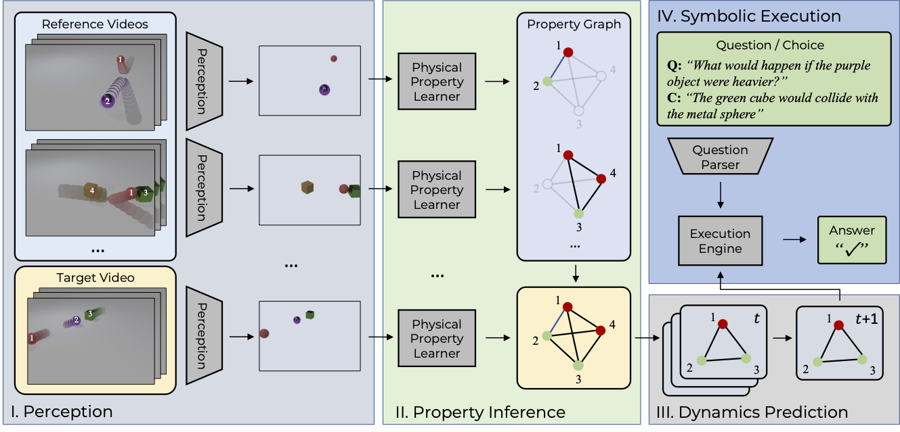

# ComPhy
This repository holds the code for the paper.

> 
**ComPhy: Compositional Physical Reasoning ofObjects and Events from Videos**,
Zhenfang Chen, Kexin Yi, Yunzhu Li, Mingyu Ding, Antonio Torralba, Joshua B. Tenenbaum, Chuang Gan, (Under review)
>
[PDF](https://openreview.net/pdf?id=wgQoeAdyk11)

[Project Website](https://comphyneurips.github.io/)

## Framework
<div align="center">
  
</div>

## Code Preparation
```
git clone https://github.com/zfchenUnique/executor_comphy.git
```

## Installation
```
pip install -r requirements
```

## Data Preparation
- Download videos, video annotation, questions from the [official website](https://comphyneurips.github.io/).

## Fast Evaluation
- Download the regional proposals with attribute and physical property prediction from [Google drive](https://drive.google.com/file/d/1eaV0yaqKbSnPg_7g0Q9eJ2TZTOJaKyyn/view?usp=sharing)
- Download the dynamic predictions from [Google drive](https://drive.google.com/file/d/1QD1o-8UArrGWvA-AQ--xNZzplBzXLKgY/view?usp=sharing)
- Run executor for factual questions.
```
sh scripts/test_oe_release.sh
```
- Run executor for multiple-choice questions.
```
sh scripts/test_mc_release.sh
```
## Supporting sub-modules
### Physical Property Learner and Dynamic predictor
Please refer to [this repo](https://github.com/zfchenUnique/property_learner_predictor.git) for property learning and dynamics prediction.
### Perception
This module uses the [NS-VQA](https://github.com/kexinyi/ns-vqa.git)'s perception module object detection and visual attribute extraction.
### Program parser 
This module uses the [NS-VQA](https://github.com/kexinyi/ns-vqa.git)'s program parser module to tranform language into executable programs.
